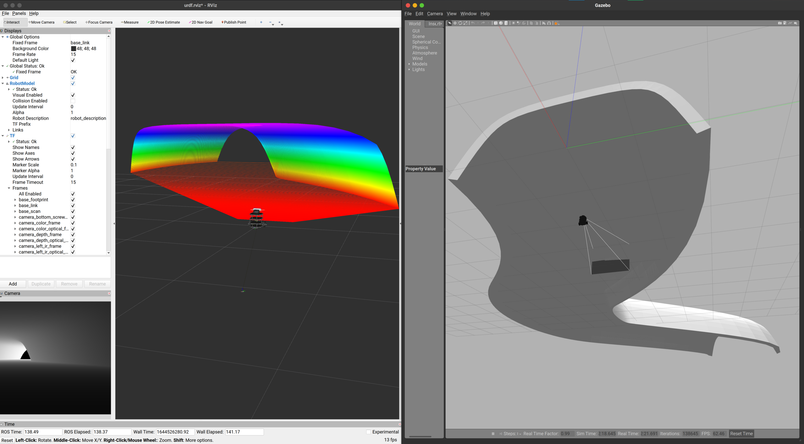

# Turtlebot3 + RealSense D435 + Tunnel + Simple Navigation
This is my personal ROS practice example that put Turtlebot burger with Realsense D435 in a simple tunnel scene and applies a simple auto mode drive the turtlebot out of the tunnel itself.

I will describe how to import D435 into your own model/world because I found there are only few instruction about do so. For more models (e.g. D455), you can go to RealSense offical Github to find the urdf/xacro files and build the `.so` file yourself.



# Configuration
Althoug the configuation should not be the problem, still I put them down below for those who would like to know.
OS: Ubuntu 20.04
ROS: noetic
Gazebo: 11


# Install
1. install ROS and packages
    ```bash
    sudo apt-get install ros-noetic-desktop-full
    ```
    replace the 'noetic' to other version to be competitble to your pc

1. Download this repo
    ```bash
    # build your work space directories, e.g. `catkin_ws` in my example
    mkdir catkin_ws
    cd catkin_ws
    mkdir src
    cd src
    # clone the repo
    git clone 
    ```
1. Build the project
    ```bash
    cd ..
    catkin_make
    ```
    this will generate a `librealsense_gazebo_plugin.so` file to simulate D435 in Gazebo
# Explanation
## Packages
- **beginner_tutorial**: basic ROS operations e.g. node, topics, services

- **realsense_gazebo_plugin**: to generate RealSense sensor simulation plugin for Gazebo to use

- **realsense2_description**: RealSense sensor models

- **robotcontrol**: simple navigation codes. The original codes are from the first link in the reference.

- **turtlebot3**: turtlebot3 models

- **turtlebot3_msgs**: turtlebot3 messages

- **turtlebot3_simulations**: turtlebot3 simulation files (e.g. world models, .world, .launch)


# Usage
> :bulb: I kind of messed up the original turtlebot3 repos by modifying it directly, but it is still worth to play around with it :stuck_out_tongue:
## Launch the world
To launch the simulation that includes turtlebot3_burger + RealSense D435 + Tunnel
```bash
roslaunch turtlebot3_gazebo turtlebot3_tunnel.launch
```

## Self-driving
First change the permission of the files
```bash
roscd robotcontrol/src
chmod +x test.py self_drive.py
```
1. Move the robot straight
    ```bash
    ./test.py
    ```
1. Move the robot to drive out of the tunnel
    ```bash
    ./self_drive.py
    ```

# Import RealSense D435 into your model/wrold
1. To generate `librealsense_gazebo_plugin.so` file only, make sure `realsense_gazebo_plugin` repo is under `/src` and build it.
    ```bash
    cd ..   # to catkin_ws
    catkin_make
    # or use catkin tool to specify which pkg to build
    catkin build realsense_gazebo_plugin
    ```
    Then you will find the file under `/catkin_ws/devel/lib`
1. copy `_d435.gazebo.xacro` and `_d435.urdf.xacro` into `/your_pkg/urdf` where you want to simulate
1. in the file _d435.urdf.xacro change the line 13 from
    ```xml
    <xacro:include filename="$(find packagename)/urdf/urdf _d435.gazebo.xacro">
    ```
    to your `package_name`
1. In your `model.urdf.xacro` (`turtlebot3_burgher.urdf.xacro` in my example), put the following lines:
    ```xml
        <xacro:include filename="$(find packagename)/urdf/_d435.urdf.xacro" />
    ...
        <xacro:sensor_d435 name="camera" topics_ns="camera" parent="base_link" publish_pointcloud="true">
            <origin xyz="0 0 0" rpy="0 0 0" />
        </xacro:sensor_d435>
    ```
    and change your desired orginal pose related to `base_link`
1. In the launch file, don't forget to publish the `tf` tree for rviz to visualize
    ```xml
        <node pkg="robot_state_publisher" type="robot_state_publisher"  name="robot_state_publisher">
            <param name="publish_frequency" type="double" value="30.0" />
        </node>
    ```
    > For more detailes, please check the files that related to `burger` model or the keyword `tunnel` under `turtlebot3_simulations/turtlebot3_gazebo`.


# Reference
[ROS系統控制自走車搭配點雲雷達(隧道檢測裝置) - 微醺咖啡](https://ithelp.ithome.com.tw/users/20129807/ironman/3282?page=1)

[Gazebo Tutorial](http://gazebosim.org/tutorials?cat=connect_ros)

[realsense2_description - issaiass](https://github.com/issaiass/realsense2_description)

[realsense_gazebo_plugin - pal-robotics](https://github.com/pal-robotics/realsense_gazebo_plugin)


# Contact Info
If you have any question please don't hesitate to contact me:

Wen-Yu Chien: leochien1110@gmail.com

[LinkedIn](https://www.linkedin.com/in/wenyu-chien/)

[Gitpage](https://leochien1110.github.io)